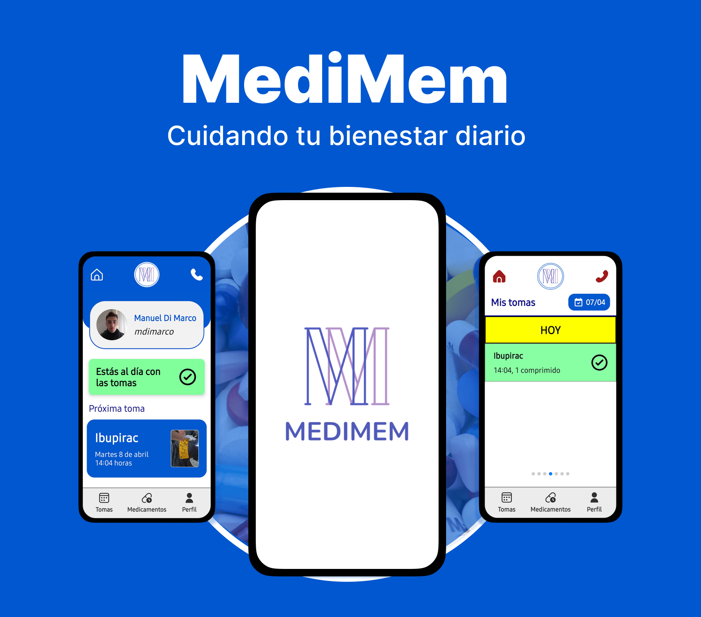

<h1 align="center">Hi there 👋, I'm Manuel Di Marco</h1>

  💻 Software Engineer | 📱 Mobile Developer | 🎯 Product Creator | ⚙️ Backend Developer 
  Currently working at <b>Microtrack S.A.</b> 
  Passionate about building impactful software and exploring AI & ML.

---

### 👨‍💻 About Me

- 🎓 I’m a Computer Engineer
- 🚀 I build mobile apps and backend services
- 🧠 Currently diving deeper into **AI** and **Machine Learning**
- 🔧 Always experimenting and learning something new
- 💬 Ask me about mobile dev, backend, or building real-world products
- 📫 Reach me at: [manuelbdimarco@gmail.com] | [LinkedIn](https://www.linkedin.com/in/manuel-baltasar-di-marco-b94955215/)

---

### 🛠️ Tech Stack

---

### 📱 Featured Projects

#### 🟦 MediMem — Medication Reminder App

> React Native + Expo + Spring Boot + MongoDB  
> Helps users manage their medication schedules and stay up to date with reminders.

🔗 [Frontend Repo](https://github.com/manueldimarco/frontendMediMem)  
🔗 [Backend Repo](https://github.com/manueldimarco/MediMem_Backend)  
🎥 [Demo on LinkedIn](https://www.linkedin.com/posts/manuel-baltasar-di-marco-b94955215_reactnative-springboot-mongodb-activity-7315446670178058240-AIn5?utm_source=share&utm_medium=member_desktop&rcm=ACoAADZseWABF_czF011UFKezBn98QN1B-9GGnw)

---

<table>
  <tr>
    <td style="vertical-align: top; padding-right: 20px;">

      <h4>🟩 Helpay — Payment Helper for People with Cognitive Disabilities</h4>
      

        <strong>React Native + Expo</strong> 
        Calculates payment combinations with physical bills to assist people with cognitive disabilities.
      

      🔗 <a href="https://github.com/manueldimarco/helpayApp">Helpay Repo</a>

    </td>
    <td>
      
    </td>
  </tr>
</table>

---

### 📫 Contact

- 📧 manuelbdimarco@gmail.com  
- 💼 [LinkedIn](://www.linkedin.com/in/manuel-baltasar-di-marco-b94955215/)

---
